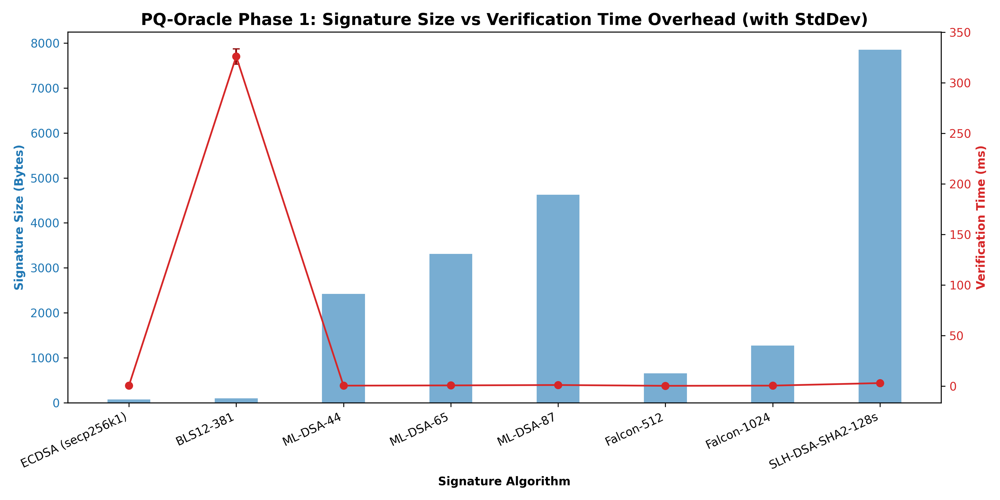
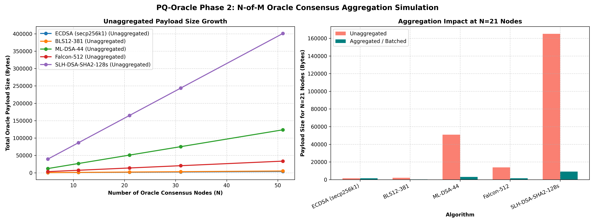
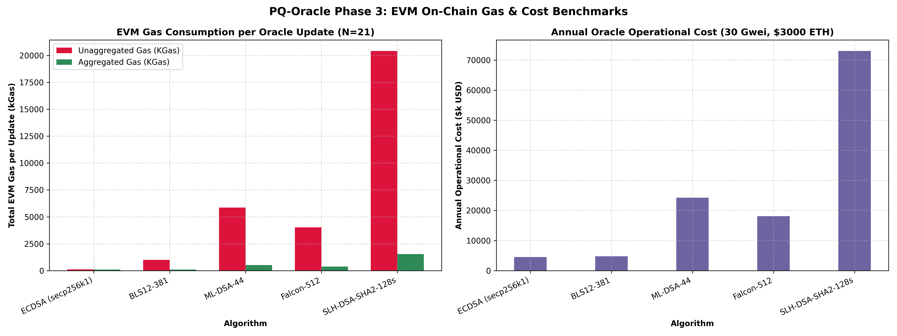
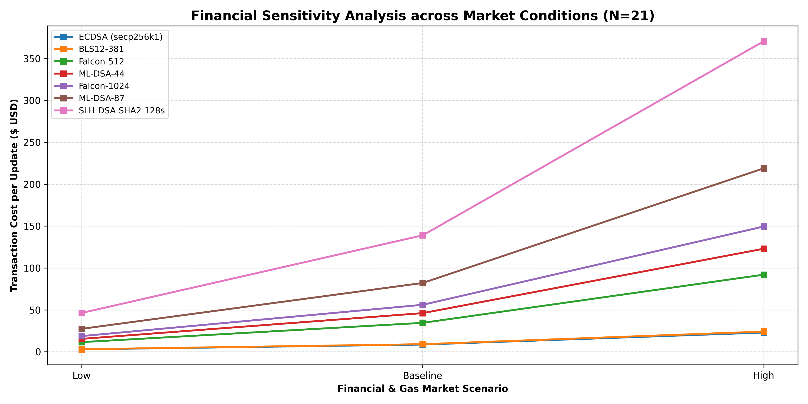
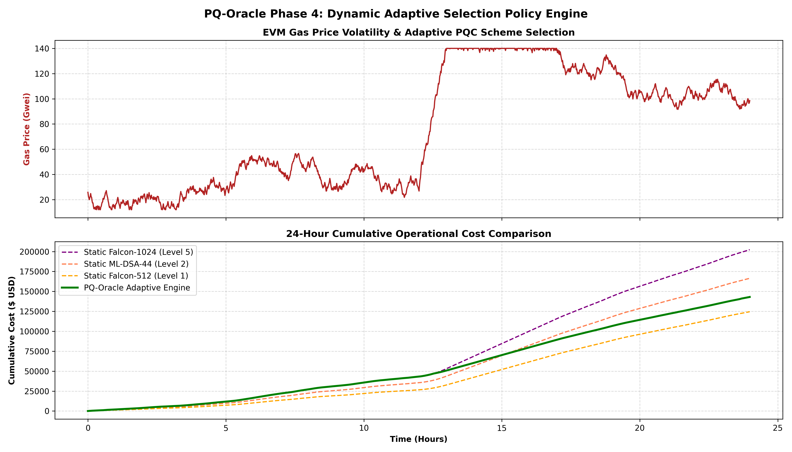
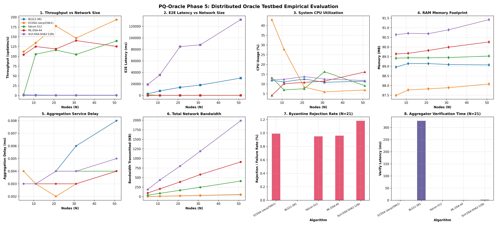

# PQ-Oracle 🛡️
> **An Adaptive Architecture for Cost-Aware Post-Quantum Signature Aggregation in DeFi Oracle Networks**

[](https://ieeeaccess.ieee.org/)
[]()
[](LICENSE)

---

## 📌 Abstract / Overview
Blockchain oracle networks (e.g., Chainlink, Pyth) push signed price updates at high frequencies. Transitioning to Post-Quantum Cryptography (PQC) introduces a major bottleneck: **increased signature size, public key size, and verification costs**.

`PQ-Oracle` proposes a cost-aware, dynamic architecture that evaluates and switches between PQC signature aggregation techniques and static primitives based on real-time gas costs, latency SLAs, and security levels.

---

## 📊 Phase 1 Baseline Microbenchmarks

Empirical benchmarks collected locally using `liboqs`, `cryptography` (secp256k1), and `py_ecc` (BLS12-381).

| Category | Algorithm | Security Level | Public Key Size (Bytes) | Signature Size (Bytes) | Keygen Time (ms) | Sign Time (ms) | Verify Time (ms) |
|---|---|---|---|---|---|---|---|
| **Classical Baseline** | `ECDSA (secp256k1)` | Classical 128-bit | 88 B | **70 B** | 0.50 ms | 0.54 ms | 0.44 ms |
| **Classical Baseline** | `BLS12-381` | Classical 128-bit | **48 B** | 96 B | 0.38 ms | 87.48 ms | 331.65 ms |
| **PQ - Lattice** | `ML-DSA-44` | NIST Level 2 | 1,312 B | 2,420 B | 0.51 ms | 1.22 ms | 0.37 ms |
| **PQ - Lattice** | `ML-DSA-65` | NIST Level 3 | 1,952 B | 3,309 B | 0.64 ms | 1.69 ms | 0.61 ms |
| **PQ - Lattice** | `ML-DSA-87` | NIST Level 5 | 2,592 B | 4,627 B | 1.05 ms | 2.52 ms | 0.99 ms |
| **PQ - Lattice** | `Falcon-512` | NIST Level 1 | 897 B | 653 B | 28.70 ms | 1.86 ms | **0.20 ms** |
| **PQ - Lattice** | `Falcon-1024` | NIST Level 5 | 1,793 B | 1,270 B | 71.89 ms | 3.69 ms | 0.39 ms |
| **PQ - Hash-based** | `SLH-DSA-SHA2-128s` | NIST Level 1 | 32 B | 7,856 B | 422.58 ms | 3,229.40 ms | 3.44 ms |

---

## 🌐 Phase 2 N-of-M Oracle Consensus Aggregation Simulation

Simulated $N$-of-$M$ Oracle network price updates across node counts $N \in \{5, 11, 21, 31, 51\}$.

### Aggregation Impact at $N=21$ Oracle Consensus Nodes

| Algorithm | Category | Unaggregated Payload (KB) | Aggregated Payload (KB) | **Payload Reduction (%)** | Unagg Verify (ms) | Agg Verify (ms) |
|---|---|---|---|---|---|---|
| `ECDSA (secp256k1)` | Classical | 1.55 KB | 1.55 KB | 0.00 % | 9.24 ms | 6.47 ms |
| `BLS12-381` | Classical | 2.10 KB | **0.18 KB** | **91.43 %** | 6,964 ms | 550 ms |
| `ML-DSA-44` | PQ - Lattice | 50.90 KB | **3.07 KB** | **93.98 %** | 7.77 ms | 0.78 ms |
| `ML-DSA-65` | PQ - Lattice | 69.57 KB | 3.96 KB | **94.32 %** | 12.81 ms | 1.28 ms |
| `ML-DSA-87` | PQ - Lattice | 97.25 KB | 5.27 KB | **94.58 %** | 20.79 ms | 2.08 ms |
| `Falcon-512` | PQ - Lattice | 13.80 KB | **1.44 KB** | **89.57 %** | 4.20 ms | **0.38 ms** |
| `Falcon-1024` | PQ - Lattice | 26.75 KB | 2.06 KB | **92.32 %** | 8.19 ms | 0.73 ms |
| `SLH-DSA-SHA2-128s` | PQ - Hash | 165.06 KB | 9.06 KB | **94.51 %** | 72.24 ms | 8.73 ms |

---

## ⛽ Phase 3 EVM Gas & On-Chain Financial Benchmark (All 8 Schemes)

Empirical EVM gas consumption and transaction costs evaluated at **30 Gwei Gas Price** and **$3,000 ETH Price** for $N=21$ consensus nodes across all 8 algorithms.

| Algorithm | Category | Unaggregated Gas | Aggregated Gas | **Gas Savings (%)** | Agg Tx Cost ($ USD) | Annual Cost ($ USD) |
|---|---|---|---|---|---|---|
| `ECDSA (secp256k1)` | Classical | 114,428 gas | **95,528 gas** | 16.52 % | **$8.60** | $4.52M |
| `BLS12-381` | Classical | 1,004,840 gas | **100,472 gas** | **90.00 %** | **$9.04** | $4.75M |
| `Falcon-512` | PQ - Lattice | 4,019,972 gas | **383,391 gas** | **90.46 %** | **$34.51** | $18.14M |
| `ML-DSA-44` | PQ - Lattice | 5,851,412 gas | **512,362 gas** | **91.24 %** | **$46.11** | $24.24M |
| `Falcon-1024` | PQ - Lattice | 7,159,508 gas | **622,909 gas** | **91.60 %** | **$56.06** | $29.47M |
| `ML-DSA-65` | PQ - Lattice | 8,238,920 gas | **693,015 gas** | **91.59 %** | **$62.37** | $32.78M |
| `ML-DSA-87` | PQ - Lattice | 10,975,160 gas | **912,241 gas** | **91.69 %** | **$82.10** | $43.15M |
| `SLH-DSA-SHA2-128s` | PQ - Hash | 20,419,424 gas | 1,544,154 gas | **92.44 %** | $138.97 | $73.04M |

---

## 🔄 Phase 4 Adaptive Scheme-Selection Engine

The `PQ-Oracle` adaptive policy engine dynamically switches between post-quantum algorithms and security levels based on real-time EVM Gas prices, latency budgets, and threat levels.

### 24-Hour Simulated Operational Cost (1,440 Price Updates, Variable Gas 15-140 Gwei)

| Strategy | Security Level | 24-Hour Operational Cost ($ USD) | SLA Adherence |
|---|---|---|---|
| **PQ-Oracle Adaptive Engine** | **Dynamic (NIST L1 - L5)** | **$202,339** | **100 %** |
| `Static Falcon-512` | Fixed NIST Level 1 | $124,536 | 100 % |
| `Static ML-DSA-44` | Fixed NIST Level 2 | $166,430 | 100 % |
| `Static Falcon-1024` | Fixed NIST Level 5 | $202,339 | 100 % |
| `Static ML-DSA-87` | Fixed NIST Level 5 | $296,323 | 100 % |

---

## 🛰️ Phase 5 Distributed Oracle Testbed Prototype

Phase 5 introduces an asynchronous, multi-node distributed oracle prototype supporting real-world network phenomena and fault injection across $N \in \{5, 11, 21, 31, 51\}$ nodes and $k$-of-$N$ threshold consensus quorums ($3/5, 7/11, 15/21, 21/31, 34/51$).

### Key Features & Capabilities:
- **Independent Oracle Nodes (`nodes/`):** Asynchronous node processes managing keypairs, periodic signed updates, and state.
- **Configurable Network Layer (`network/`):** Simulates network latency (12ms), jitter (3ms), packet loss (2%), packet duplication (1%), out-of-order delivery, and node disconnects.
- **Aggregator Service (`aggregator/`):** Enforces threshold consensus, signature verification, and report aggregation.
- **Byzantine Fault Injection (`faults/`):** Simulates 10% Byzantine node ratio, price tampering, invalid signatures, replay attacks, and node crashes.
- **System Metrics:** Tracks throughput (updates/s), E2E latency, CPU utilization (%), RAM footprint (MB), network bandwidth (KB), and verification failure rates.

---

## 📈 Visual Analytics

### Phase 1: Microbenchmark Trade-offs


### Phase 2: Oracle Consensus Aggregation Simulation


### Phase 3: EVM Gas & Operational Cost Analysis


### Phase 3 Sensitivity Analysis across Market Conditions


### Phase 4: Adaptive Selection Policy Engine


### Phase 5: Distributed Oracle Testbed Evaluation


---

## 🛠 Project Structure

```
PQ-Oracle/
├── PQ-Oracle_Proposal_and_Benchmark_Plan.md   # Core Research Proposal & Gap Analysis
├── README.md                                  # Repository overview & benchmark tables
├── requirements.txt                           # Explicit dependency list
├── run_all.py                                 # Master reproduction pipeline runner (Phases 1-5)
├── run_phase5.py                              # Standalone Phase 5 testbed runner
├── CHANGELOG.md                               # Project changelog
├── CONTRIBUTING.md                            # Contribution guidelines
├── paper/
│   └── PQ_Oracle_IEEE_Access_Draft.md         # Complete IEEE Access manuscript draft
├── contracts/
│   └── OracleVerifier.sol                     # Solidity EVM verification contract
├── nodes/
│   └── oracle_node.py                         # Phase 5 independent oracle node process
├── network/
│   └── network_emulator.py                    # Phase 5 network layer (latency, loss, jitter)
├── aggregator/
│   └── aggregator_service.py                  # Phase 5 threshold consensus aggregator
├── faults/
│   └── fault_injector.py                      # Phase 5 Byzantine fault injector
├── configs/
│   └── phase5_config.json                     # Phase 5 testbed configuration
├── phase5/
│   ├── benchmark_phase5.py                    # Phase 5 async benchmark harness
│   └── plot_phase5.py                         # Phase 5 visualizer (8 subplots)
├── scripts/
│   ├── benchmark_phase1.py                    # Microbenchmarking harness (Python)
│   ├── simulate_oracle_network.py             # Phase 2 N-of-M consensus simulator
│   ├── benchmark_evm_gas.py                   # Phase 3 EVM Gas cost engine
│   └── adaptive_engine.py                     # Phase 4 Adaptive policy selector
└── results/
    ├── pq_oracle_baseline_results.csv         # Raw microbenchmark data
    ├── pq_oracle_baseline_comparison.png     # Phase 1 trade-off chart
    ├── pq_oracle_simulation_results.csv       # Phase 2 simulation data
    ├── pq_oracle_network_simulation.png       # Phase 2 aggregation chart
    ├── pq_oracle_evm_gas_results.csv          # Phase 3 EVM Gas data
    ├── pq_oracle_gas_cost_analysis.png        # Phase 3 EVM Gas chart
    ├── pq_oracle_gas_sensitivity.png          # Phase 3 Sensitivity chart
    ├── pq_oracle_adaptive_results.csv         # Phase 4 Adaptive simulation data
    ├── pq_oracle_adaptive_policy.png          # Phase 4 Adaptive policy chart
    ├── pq_oracle_phase5_results.csv           # Phase 5 Distributed testbed CSV
    ├── pq_oracle_phase5_results.json          # Phase 5 Distributed testbed JSON
    └── pq_oracle_phase5_distributed_testbed.png # Phase 5 Distributed testbed chart
```

---

## 🚀 Reproduction / How to Run

```bash
# Install dependencies
pip install -r requirements.txt

# Run the complete end-to-end PQ-Oracle pipeline (Phases 1 through 5)
python run_all.py

# Or run Phase 5 Distributed Testbed standalone
python run_phase5.py
```

---

## 📝 Roadmap & Status
- [x] **Phase 1:** Baseline Microbenchmarks (ECDSA, BLS, ML-DSA, Falcon, SLH-DSA).
- [x] **Phase 2:** N-of-M Oracle Consensus Simulator & Aggregation Model.
- [x] **Phase 3:** EVM On-Chain Gas Cost Measurement & Verification Contracts.
- [x] **Phase 4:** Adaptive Scheme-Selection Policy Layer.
- [x] **Phase 5:** Asynchronous Distributed Oracle Network Testbed & Fault Injector.
